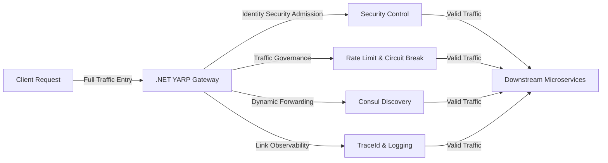

# API Gateway Core Responsibilities, JWT Public Key Verification Principles and Upstream/Downstream Request Processing Mechanisms

## 1\. API Gateway Core Positioning and Responsibilities \(Gateway\-Specific Focus\)

The **\.NET 10 YARP self\-developed gateway** serves as the **unique entry point for full\-link traffic** in the entire architecture\. All client requests must pass through the gateway for admission control\. The gateway**does not process any business logic** and is fully responsible for all**non\-business cross\-cutting governance, security verification, and traffic forwarding**, acting as the security barrier and traffic scheduling hub for the microservice ecosystem\.

The gateway focuses exclusively on four core capabilities:

**1\. Identity Security Admission \(Core Capability\)**

Unifies interception of all requests, completes legal verification of JWT tokens, rejects illegal, expired, and tampered requests, and achieves centralized global authentication and authorization\.

**2\. Full\-Dimensional Traffic Governance**

Integrates interface rate limiting, request circuit breaking, and timeout control to block malicious high\-frequency requests and faulty traffic, ensuring the stability of downstream microservices\.

**3\. Dynamic Traffic Forwarding**

Perceives healthy downstream service instances in real time via Consul, dynamically generates routing rules, automatically forwards requests and truncates route prefixes, fully transparent to client\-side applications\.

**4\. Unified Link Observability**

Injects global TraceId uniformly, records full\-link request logs and exception logs, and provides a unified entry for troubleshooting\. Downstream services are exempt from repetitive implementation of basic observability capabilities\.



```mermaid
graph LR
A[Client Request] -- Full traffic entry --> B[.NET YARP Gateway]
B -- 1.Identity Auth --> C[Security Admission]
B -- 2.Traffic Governance --> D[Rate Limit & Circuit Break]
B -- 3.Dynamic Routing --> E[Consul Service Discovery]
B -- 4.Link Observation --> F[TraceId & Logging]
C & D & E & F -- Valid Traffic --> G[Downstream Microservices]```

## 2\. Underlying Core Principles of Gateway JWT Public Key Verification

### 2\.1 Basic Key System Mechanism

The system adopts the **RSA asymmetric encryption algorithm** with strictly divided public and private key responsibilities to ensure maximum security:

- **Private Key \(Held exclusively by the authentication center\)**: Used exclusively for **JWT token issuance and signing**\. Never exposed, synchronized, or shared externally\.

- **Public Key \(Held exclusively by the gateway\)**: Used for **JWT token verification and legitimacy validation**\. Possesses only verification capabilities with no token issuance privileges\.

The gateway implements **stateless verification** throughout the process without relying on any third\-party APIs or caching user sessions\. All validation is completed locally via the loaded RSA public key\.

```mermaid
graph TD
AuthCenter[Authentication Center] -- Private Key Sign --> JWT[Issue JWT Token]
JWT -- Token Delivery --> Client[Client Side]
Client -- Bring JWT --> Gateway[API Gateway]
Gateway -- Local Public Key Verify --> Check{Signature Valid?}
Check -- Yes --> Pass[Release Request]
Check -- No --> Reject[Reject 401 Unauthorized]
```

```mermaid
graph TD
A[Authentication Center] -- Hold Private Key --> B[JWT Sign & Issue Token]
B -- Token Delivery --> C[Client]
C -- Carry JWT Token --> D[API Gateway]
D -- Hold Public Key --> E[Stateless Signature Verification]
E -- Valid --> F[Release Request]
E -- Invalid --> G[Reject 401]```

### 2\.2 Multi\-Public\-Key Compatibility Logic \(Core Architectural Highlight\)

During startup, the gateway automatically loads a dual public key set to eliminate service interruption caused by key rotation:

- **Active Public Key**: Validates newly issued JWT tokens and serves as the primary verification key\. Service startup fails if this key is missing\.

- **Legacy Archive Public Key**: Compatibility support for unexpired old tokens issued before key rotation, ensuring zero\-service\-interruption iteration\.

Underlying principle: JWT signatures are uniquely generated and strongly bound to the corresponding private key\. The gateway verifies token signatures sequentially via multiple public key sets\. A token is deemed valid if **any public key passes verification**, enabling smooth and seamless key migration\.

### 2\.3 Complete Gateway Verification and Release Workflow

The gateway executes a standardized synchronous blocking verification pipeline for every client request with zero omissions:

**1\. Request Interception**: All business route requests are intercepted by the gateway; anonymous health check endpoints are directly released\.

**2\. Token Parsing**: Extracts Bearer Token from request headers and parses the three JWT components: header, payload, and signature\.

**3\. Legitimacy Verification**: Validates signature integrity, issuer legitimacy, and token expiration using the locally loaded RSA public key list\.

**4\. Policy Authorization**: Matches global gateway authorization policies to verify authenticated user legitimacy\.

**5\. Traffic Risk Control**: Executes token\-bucket rate limiting and circuit\-breaking rules to check for threshold overflow and downstream circuit break status\.

**6\. Request Release**: Generates a global TraceId and preprocesses request parameters only after all verification items pass\.

**Failure Fallback Mechanism**: Requests with invalid signatures, expired tokens, insufficient permissions, or triggered rate limiting/circuit breaking are directly rejected by the gateway with standard error codes such as 401/429\. **No invalid requests reach downstream microservices**\.

```mermaid
graph TD
Req[Client Request] -- 1.Intercept --> G[Gateway Capture Request]
G -- 2.Parse JWT --> Parse[Resolve Header/Payload/Signature]
Parse -- 3.Legitimacy Check --> Verify[Signature & Expiration Verify]
Verify -- 4.Policy Auth --> Auth[User Permission Verify]
Auth -- 5.Traffic Control --> Flow[Rate Limit & Circuit Break]
Flow -- All Pass --> OK[Generate TraceId & Release]
Flow -- Any Failed --> Fail[Return 401/429 Block]
```

```mermaid
graph TD
A[Client Request] -- 1.Intercept --> B[Gateway Capture Request]
B -- 2.Parse Token --> C[Resolve JWT Header/Payload/Signature]
C -- 3.Verify Legitimacy --> D[Public Key Signature + Expiration Check]
D -- 4.Policy Auth --> E[User Permission Verification]
E -- 5.Traffic Control --> F[Rate Limit & Circuit Break Check]
F -- All Pass --> G[Generate TraceId & Release]
F -- Any Fail --> H[Return 401/429 Block]```

## 3\. Downstream Microservice Processing Mechanism After Gateway Release

After the gateway completes all security and traffic validations and releases requests, downstream microservices**do not need to repeat basic security checks** and can fully focus on core business logic execution\. The detailed processing mechanism is as follows:

**1\. Transparent Request Reception**: The gateway automatically truncates route prefixes \(e\.g\., /payment\), forwards standardized API requests to corresponding backend service pods\.

**2\. Trusted Traffic Ingestion**: Downstream services inherently trust all requests released by the gateway, eliminating redundant verification and rate limiting to reduce performance overhead\.

**3\. Business Identity Parsing**: Downstream services extract business identity information \(user ID, role permissions, etc\.\) from gateway\-passed tokens or request headers for business\-level access control judgment\.

**4\. Core Business Execution**: Processes core business scenarios including orders, payments, and user management without caring about underlying capabilities such as traffic security and link tracing\.

**4\. Core Business Execution**: Processes core business scenarios including orders, payments, and user management without caring about underlying capabilities such as traffic security and link tracing\.

**5\. Unified Response Return**: Business execution results are returned to the gateway and responded to clients uniformly by the gateway layer\.

```mermaid
graph LR
Gateway[API Gateway] -- Trim Prefix & Forward --> Micro[Downstream Microservice]
Micro -- Trust Gateway Traffic --> Identity[Parse User Identity]
Identity -- No Repeat Security Check --> Business[Execute Business Logic]
Business -- Return Result --> Gateway
Gateway -- Unified Response --> Client[End Client]
```

**5\. Unified Response Return**: Business execution results are returned to the gateway and responded to clients uniformly by the gateway layer\.

```mermaid
graph LR
A[Gateway] -- Trim Prefix & Forward --> B[Downstream Microservice]
B -- Trust Gateway Traffic --> C[Parse User Identity from Header]
C -- No Repeat Security Check --> D[Execute Core Business Logic]
D -- Business Result --> A
A -- Unified Response --> E[End Client]```

## 4\. Full\-Link Stability and Security Assurance Mechanisms \(Gateway\-Layer Core Guarantees\)

### 4\.1 Security Assurance Mechanisms

- **Least Privilege Security**: The gateway only holds public keys without token signing privileges\. Even if the gateway is compromised, attackers cannot forge valid JWT tokens\.

- **Tamper and Forgery Resistance**: The RSA signature mechanism ensures that any tampering with JWT payloads or token forgery is intercepted by the gateway, provided the private key remains undisclosed\.

- **Highly Available Key Compatibility**: The multi\-public\-key mechanism supports dynamic key rotation without service downtime or interruption to normal user requests\.

- **Global Security Consolidation**: Uniform verification of all external network requests eliminates security risks caused by exposed or unprotected downstream service endpoints\.

### 4\.2 Traffic and Stability Assurance Mechanisms

- **Fault Isolation**: YARP built\-in circuit breaking and timeout mechanisms enable fast failure responses during downstream service anomalies, preventing fault propagation and service avalanche\.

- **Traffic Peak Shaving**: Global gateway rate limiting blocks malicious crawlers and burst high\-frequency requests, stabilizing downstream service load\.

- **Dynamic Fault\-Tolerant Forwarding**: Monitors Consul healthy instance status in real time, automatically excludes faulty nodes, and forwards traffic only to healthy service pods\.

- **Traceable Full Link**: The unified TraceId runs through the gateway and downstream services, enabling rapid positioning of faults at either the gateway layer or business layer\.

```mermaid
graph TD
subgraph Security
S1[RSA Asymmetric Verify] -- Anti-Tamper & Forgery --> S2[Global Security Entry]
S3[Multi-Key Rotation] -- Zero Downtime Upgrade --> S4[High Available Auth]
end
subgraph Traffic Stability
T1[Rate Limit & Peak Shaving] -- Protect Service Load --> T2[Malicious Traffic Block]
T3[Circuit Breaking] -- Fault Isolation --> T4[Prevent Service Avalanche]
T5[Consul Dynamic Forward] -- Eliminate Fault Nodes --> T6[Stable Traffic Dispatching]
end
S2 & S4 & T2 & T4 & T6 --> Final[Stable & Secure Microservice System]
```

- **Traceable Full Link**: The unified TraceId runs through the gateway and downstream services, enabling rapid positioning of faults at either the gateway layer or business layer\.

```mermaid
graph TD
subgraph Security Protection
A[RSA Asymmetric Verification] -- Anti-Tamper/Forgery --> A1[Global Security Entry]
B[Multi-Key Rotation] -- Zero Downtime Update --> B1[High Available Auth]
end
subgraph Traffic Stability
C[Rate Limit & Peak Shaving] -- Block Malicious Traffic --> C1[Load Stabilization]
D[Circuit Break & Fault Isolation] -- Prevent Avalanche --> D1[Fault Containment]
E[Consul Dynamic Forwarding] -- Skip Fault Nodes --> E1[High Availability Traffic]
end
A1 & B1 & C1 & D1 & E1 --> F[Stable & Secure Microservice Cluster]```

## 5\. Core Summary \(Gateway\-Specific Focus\)

The API gateway acts as the **security firewall and traffic scheduling hub** for the entire microservice architecture\. Its core value lies in **unified convergence of all non\-business generic capabilities**\. It implements stateless, high\-security global authentication based on RSA asymmetric public key verification and resolves key iteration compatibility issues via the multi\-public\-key mechanism\.

All requests undergo layered verification, filtering, and governance at the gateway\. Only legitimate, compliant, and healthy traffic is forwarded to downstream microservices\. Downstream services are completely decoupled from underlying security, traffic, and observability capabilities and focus solely on business implementation\. Leveraging the gateway’s fault isolation, traffic protection, and dynamic scheduling capabilities, the overall microservice architecture achieves core architectural goals including security controllability, operational stability, and clear responsibility decoupling\.

> （注：部分内容可能由 AI 生成）
