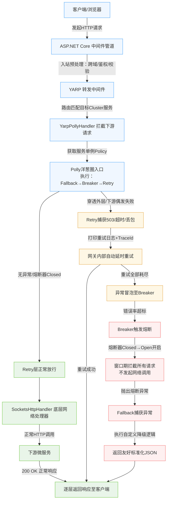

# YARP集成Polly重试、熔断、降级策略及全请求链路总结

本文基于YARP底层转发机制，梳理**YARP网关\+Polly（重试/熔断/降级）**整套容错架构的核心原理、策略执行逻辑、完整请求链路及架构核心优势，明确ASP\.NET Core中间件与YARP下游容错的核心边界，厘清整套流量容错的底层运转逻辑。

## 一、核心前置认知：流量层级边界

很多架构误区源于混淆两类请求管道，二者分工明确、互不干扰：

- **ASP\.NET Core常规中间件**：处理 **客户端→网关** 的入站请求，负责权限校验、跨域、请求预处理等网关层面通用逻辑。

- **Polly容错策略**：专属处理 **网关→下游微服务** 的Downstream下游请求，针对微服务调用的网络抖动、服务宕机、异常响应做容错保护，是YARP转发链路的核心容错能力。

## 二、YARP集成Polly的底层核心原理

YARP本质是高性能HTTP转发器，会为配置中每个微服务集群（Cluster）维护独立的定制化请求处理器，整套Polly容错能力基于**装潢模式（装饰器模式）**无缝嵌入YARP原生转发管道，无侵入、高适配。

### 1\. YARP原生处理器初始化流程

YARP为每个集群初始化通信管道时，固定执行三步逻辑，预留了自定义扩展入口：

1. **CreateHandler**：创建底层网络处理器`SocketsHttpHandler`，承载DNS解析、TCP连接、HTTP2协议通信等基础网络能力。

2. **ConfigureHandler**：加载配置文件中的连接超时、证书、连接数限制等规则，完成原生处理器的参数初始化。

3. **WrapHandler（核心扩展点）**：YARP预留的虚方法，用于对初始化完成的原生处理器做二次包装，是Polly集成的核心挂钩。

### 2\. Polly的介入逻辑

通过重写YARP的`WrapHandler`方法，将YARP原生配置完成的`SocketsHttpHandler`作为内层原生处理器（InnerHandler），外层嵌套自定义的`YarpPollyHandler`。最终YARP接管的不再是原生HTTP请求客户端，而是搭载了重试、熔断、降级全套容错策略的增强型转发客户端，实现容错能力与转发管道的深度绑定。

## 三、全网请求完整执行链路（端到端）

客户端流量从接入网关到转发至下游微服务，全程遵循固定链路，容错逻辑精准嵌入转发核心环节：

1. **网关入站处理**：客户端请求接入网关，先经过ASP\.NET Core中间件管道，完成跨域、权限、请求校验等预处理。

2. **YARP路由匹配**：YARP核心转发中间件拦截请求，通过路由规则匹配目标下游微服务集群。

3. **Polly容错拦截**：请求进入`YarpPollyHandler.SendAsync`，从`GatewayPolicyProvider`获取当前目标服务的单例容错策略，启动Polly策略执行链路。

4. **容错策略执行**：请求进入Polly洋葱圈策略链，按「降级→熔断→重试」的预设顺序执行容错校验与逻辑。

5. **下游真实请求**：经过容错校验后，通过底层`SocketsHttpHandler`发起真实网络请求，调用下游目标微服务，响应结果原路回传。

## 四、Polly三大策略横向执行原理（洋葱圈机制）

架构通过`Policy.WrapAsync(fallback, breaker, retry)`编排策略顺序，形成**外层降级、中层熔断、内层重试**的洋葱圈包裹结构，不同异常场景触发对应容错机制，层级清晰、优先级明确。

### 1\. 正常场景：服务正常运行，全链路放行

请求依次穿透降级、熔断、重试策略圈，此时熔断器处于Closed闭合正常状态，无异常触发。请求直接穿透所有容错层，调用下游微服务并获取200 OK响应，原路返回客户端，无任何容错逻辑介入。

### 2\. 抖动场景：下游偶发异常，触发重试策略

当下游出现网络抖动、短暂超时、503临时不可用等偶发异常时，重试策略生效：

- 请求穿透降级、熔断层后，内层重试策略捕获异常响应；

- 触发自定义重试日志，记录重试次数、请求TraceId等关键信息；

- 网关内部短暂延迟后自动重试，重试成功则正常返回响应；

- 全程无感知，客户端仅轻微延迟，完全屏蔽下游临时抖动问题。

### 3\. 宕机场景：下游彻底不可用，触发熔断\+降级兜底

当下游服务宕机、持续报错，多次重试无法恢复时，熔断、降级策略依次生效，实现服务保护与用户兜底：

- **重试耗尽**：连续多次请求失败，每次请求的重试次数全部耗尽，异常向外传递；

- **触发熔断**：中层熔断策略检测到错误率超标，熔断器状态从Closed（闭合）切换为Open（开启），触发熔断告警日志；开启后指定时长内（默认30秒）直接拦截所有请求，不再发起下游网络调用，避免压垮故障服务、减少无效超时等待；

- **触发降级兜底**：熔断拦截产生的`BrokenCircuitException`异常，被最外层降级策略捕获，触发自定义降级逻辑，返回友好的标准化JSON响应，屏蔽服务故障，避免客户端接收原生异常报错。

## 五、架构核心精妙优势

### 1\. 零性能损耗，高性能转发

容错处理器仅在网关启动、配置刷新时，为每个微服务集群**初始化一次**，不会随每个请求重复创建。高并发流量转发时，仅执行预初始化完成的内存管道链路，无额外对象创建开销，性能接近原生YARP转发。

### 2\. 策略隔离与状态共享平衡

通过全局策略管理器的字典结构，实现**服务级策略隔离**：不同微服务（如订单服务、用户服务）的熔断器状态完全独立，某一个服务故障熔断不会影响其他服务正常转发；同时同一服务的所有请求线程共享一套熔断、重试状态，保证容错逻辑的一致性。

### 3\. 全链路可观测，故障精准诊断

Polly可精准捕获YARP转发全链路异常，无论是底层网络连接断开，还是下游业务5xx异常，均可在重试、降级回调中获取完整的异常信息、真实响应码、全链路TraceId，实现故障日志的精细化记录，方便快速定位问题。

## 六、全链路可视化详细流程图

为直观呈现 YARP\+Polly 整套容错执行逻辑，以下梳理**端到端完整流量流程图**，包含正常流量分支、偶发抖动重试分支、服务宕机熔断降级分支，完整复刻底层齿轮咬合逻辑。

### 流程图关键节点说明

- **执行顺序核心规则**：Polly 严格遵循 **由外入内执行、由内向外回传**，请求进入时：Fallback → Breaker → Retry；异常抛出时：Retry → Breaker → Fallback，是容错机制生效的核心前提。

- **熔断限流机制**：熔断器打开后（Open状态），指定窗口期内**直接拦截请求**，不经过底层网络处理器，彻底杜绝下游服务被高并发压垮，规避雪崩问题。

- **客户端无感知特性**：重试、熔断、降级所有容错逻辑**均在网关内部完成**，客户端仅接收最终统一响应，无异常报错、无流程感知。

- **管道隔离特性**：前置ASP\.NET中间件仅处理入站请求，所有下游服务容错逻辑仅作用于YARP转发链路，管道完全隔离、互不干扰。

## 七、核心总结

整套架构以**YARP扩展钩子\+装饰器模式**为核心，将Polly容错策略无缝嵌入下游转发链路，通过「内层重试解决偶发抖动、中层熔断避免服务雪崩、外层降级兜底保障用户体验」的三层洋葱圈机制，构建了完整的下游服务容错体系。同时兼顾高性能、高隔离性与可观测性，精准区分网关入站处理与下游转发容错的边界，是YARP网关实现微服务流量容错的最优架构方案之一。

整套架构以**YARP扩展钩子\+装饰器模式**为核心，将Polly容错策略无缝嵌入下游转发链路，通过「内层重试解决偶发抖动、中层熔断避免服务雪崩、外层降级兜底保障用户体验」的三层洋葱圈机制，构建了完整的下游服务容错体系。同时兼顾高性能、高隔离性与可观测性，精准区分网关入站处理与下游转发容错的边界，是YARP网关实现微服务流量容错的最优架构方案之一。

> 
